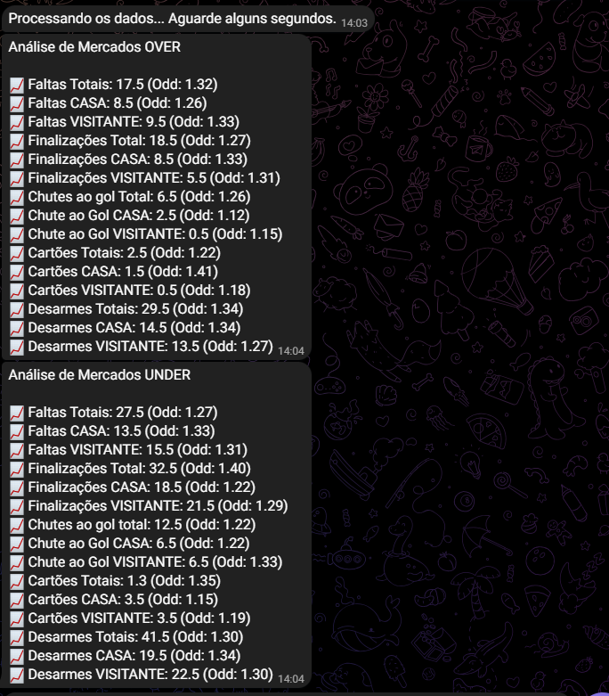

# Bot de automação de planilhas GC 

### A ideia do projeto era automatizar a coleta de dados de planilhas do excel que simulam jogos das principais ligas da Europa (*Premier League, La Liga, Bundesliga e Serie A*) e a partir da simulação traz odds bases dos times para que apostadores consigam analisar melhor suas _tips_.

1. Obter os dados da liga, times e arbitragem pelo telegram
2. Abrir a planilha de acordo com os dados fornecidos, e analisar as odds mais próximas da odd base (1.3)
3. Trazer quais são as odds mais próximas da odd base para o usuário

## Coleta de dados via telegram 

1. Ao iniciar o [bot](./bot.py) no telegram o usuário escolhe a liga que ele deseja analisar:

2. Informa o time da casa: 

3. Informa o time visitante:

4. Informa o árbitro da partida:

## Análise dos dados

Após isso, o bot analisa os dados fornecidos pelo usuário, para simular o jogo e fornecer as odds mais próximas de 1.3 para o usuário basear suas apostas: 

